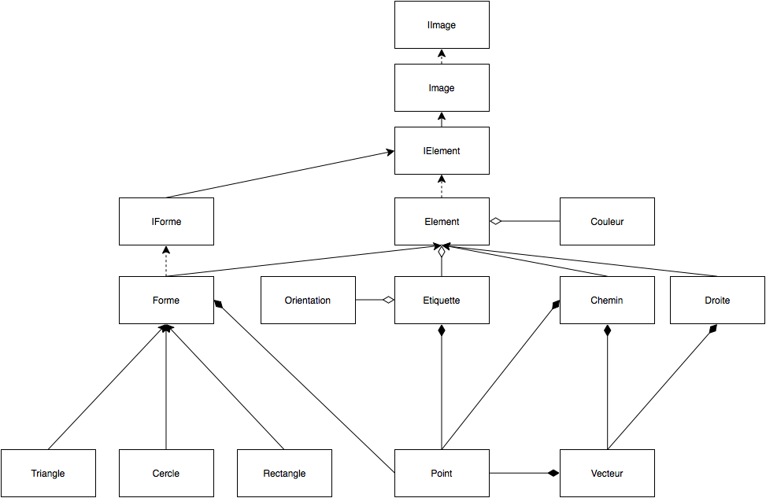
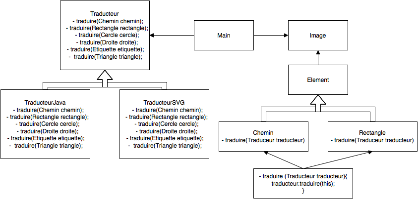

Baptiste Maillot    
Micaël M'Bagira     
Thomas Moisy

#Architecture Logicielle : 
#Rapport mi-projet dessin vectoriel 


##1. Présentation de l’architecture mise en place :

###a. Représentation d'un script: 

**Contexte :**  
Nous devons générer un script qui contient des instructions décrivant les opérations de l’utilisateur.   
**Problème :**     
Le sens de script est large car un script peut être une instruction terminale mais aussi un composite ayant une relation d’agrégation avec la classe `Script`.  
**Solution :**    
Nous utilisons le patron de conception composite puisqu’il a l’avantage de représenter de manière claire les liens entre les différents composants qui constituent un script.  Il permet de définir des méthodes communes à chaque instance sans se soucier de quelle classe d’implémentation provient la méthode qui est appelée.    
    
    

    
      
**Description du patron appliquée à notre problème :**


````java
script : InstructionTerminale
       | Sequence
       | For
       | Alternative
       ;

Sequence : scripts* ;
For      : 'for 0 to n' Sequence ;
Alternative : condition '?' script ':' script ;
InstructionTerminale : 'dessiner' | 'remplir' | 'insérer' | 'étiqueter' ;
````

###b. Structure du package dessin vectoriel


**Contexte :**  
Ce package est destiné à représenter de façon logique le dessin (l'image dans sa globalité) ainsi les éléments qui le composent.    
**Problème :**    
Le code doit être le plus modulaire possible notamment pour permettre éventuellement de rajouter de nouvelles formes ou de nouvelles fonctionnalités pour dessiner facilement.    
**Solution :**    
Nous avons utilisé une architecture en couches reposant sur des relations d'aggrégation, de composition et d'héritage. Certaines méthodes communes à différents objets sont implémentées dans des classes abstraites telles que Forme et Element qui constitue la couche haute de cette implémentation et permet d'éviter la redondance dans le code. La couche basse représente les classes concrètes d'implémentation comme Cercle, Dessin, Chemin etc.



*Les différents objets dont le nom est de la forme IObjet sont des interfaces, les classes Element et Forme sont des classes abstraites*


###c. Utilisation de la méthode Builder :

**Contexte :**  
Nous devons générer un script qui contient les instructions décrivant les opérations de l’utilisateur. Ce script est écrit dans un langage que nous avons défini.  
**Problème :**    
Comment générer les instances de `Script` sans faire appel au mot-clef `new` et que la création du script reste lisible et ressemble à un script textuel.  
**Solution :**    
Nous nous sommes inspirés de la méthode décrite dans l’article [Embedded Typesafe Domain Specific Languages for Java](http://citeseerx.ist.psu.edu/viewdoc/summary;?doi=10.1.1.180.4784) et générons un script en utilisant des Builders. Le principe est le suivant :  
	Pour créer un script (une instruction terminale ou un composite de Script) nous faisons appel à un builder, représenté par une classe qui correspond à l’instance de `Script` que nous voulons créer (par exemple `DessinerBuilder` pour créer l’instruction `Dessiner`). Le constructeur de `DessinerBuilder` appelé crée une instruction vide que l’on complète progressivement en faisant appel à la (aux) méthode(s) de `DessinerBuilder` qui retournent une instance d’un autre Builder sur lequel nous pourrons ensuite appeler d’autres méthodes pour initialiser d’autres attributs de notre instance de `DessinerBuilder`.
Par exemple, la classe `DessinerBuilder` a une méthode 

````java
public PointsBuilder points(List<Point> points);
````
qui retourne un `PointsBuilder`, classe qui a une méthode public 

````java
PointsBuilder point(int x, int y);
````
nous permettant de créer un point.

###d. Utilisation du patron visiteur pour la traduction :

Pour implémenter la traduction, nous utilisons deux classes de traductions pour les deux implémentation suivantes : TraductionJava2D et TraductionSVG, ces deux classes implémentant l'interface Traducteur. L'interface Traducteur a autant de méthode traduire(…) que de forme existantes (traduire(Carre carre), traduire(Chemin chemin) etc.).

Pour effectuer la traduction avec un traducteur choisi, on utilise le patron Visiteur qui permet de visiter toutes les forme de l'image indépendemment du traducteur. C'est lors de la visite de chaque Element, que l'implémentation du traducteur va être appelé avec en paramètre l'élément à traduire.



##2. Points à améliorer :

- Insérer : pas implémenter et pas vu l'utilité
- 